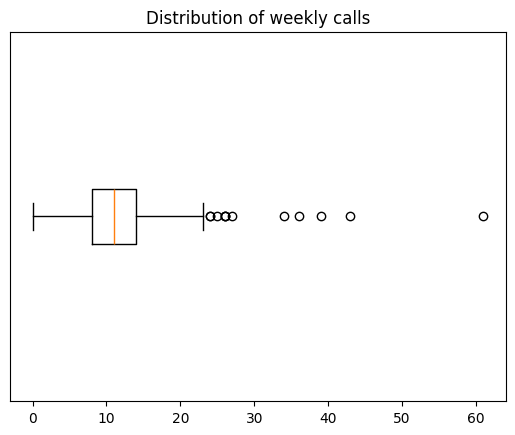

```python
# MSDS 434 - Section 55
# Winter '25
# dispatch-predictions - EDA

# Kevin Geidel

from matplotlib import pyplot as plt
import pandas as pd
pd.set_option('display.max_rows', 500)
```


```python
file_path = 'data/2025_01_14_hfd_incident_log.xls'

df = pd.read_excel(file_path, parse_dates=[['Date', 'Alarm']])

df.head()  # Raw data frame
```


<div>
<style scoped>
    .dataframe tbody tr th:only-of-type {
        vertical-align: middle;
    }

    .dataframe tbody tr th {
        vertical-align: top;
    }

    .dataframe thead th {
        text-align: right;
    }
</style>
<table border="1" class="dataframe">
  <thead>
    <tr style="text-align: right;">
      <th></th>
      <th>Date_Alarm</th>
      <th>FDID</th>
      <th>Incident#</th>
      <th>Num</th>
      <th>Address</th>
      <th>Suite</th>
      <th>Zip</th>
      <th>Type</th>
      <th>Lgth</th>
    </tr>
  </thead>
  <tbody>
    <tr>
      <th>0</th>
      <td>01/02/2000 13:41</td>
      <td>14013.0</td>
      <td>2000-000001</td>
      <td>10</td>
      <td>BARBARA LA.</td>
      <td></td>
      <td>12590</td>
      <td>Natural vegetation fire</td>
      <td>0.0</td>
    </tr>
    <tr>
      <th>1</th>
      <td>01/04/2000 12:30</td>
      <td>14013.0</td>
      <td>2000-000002</td>
      <td>2015</td>
      <td>ROUTE 9 - UNIT 16</td>
      <td></td>
      <td>12590</td>
      <td>Emergency medical service (EMS) Incident</td>
      <td>0.5</td>
    </tr>
    <tr>
      <th>2</th>
      <td>01/04/2000 12:36</td>
      <td>14013.0</td>
      <td>2000-000003</td>
      <td>52</td>
      <td>OSBORNE HILL RD.</td>
      <td></td>
      <td>12590</td>
      <td>Emergency medical service (EMS) Incident</td>
      <td>0.7</td>
    </tr>
    <tr>
      <th>3</th>
      <td>01/05/2000 22:13</td>
      <td>14013.0</td>
      <td>2000-000004</td>
      <td>NaN</td>
      <td>NEW HAMBURG RD. @ WHEELER</td>
      <td></td>
      <td>12590</td>
      <td>Service call, other</td>
      <td>1.0</td>
    </tr>
    <tr>
      <th>4</th>
      <td>01/07/2000 22:34</td>
      <td>14013.0</td>
      <td>2000-000005</td>
      <td>206</td>
      <td>OLD HOPEWELL RD.</td>
      <td></td>
      <td>12590</td>
      <td>Good intent call, other</td>
      <td>0.3</td>
    </tr>
  </tbody>
</table>
</div>


```python
# stats on the raw dataframe
df.info()
```

    <class 'pandas.core.frame.DataFrame'>
    RangeIndex: 16172 entries, 0 to 16171
    Data columns (total 9 columns):
     #   Column      Non-Null Count  Dtype  
    ---  ------      --------------  -----  
     0   Date_Alarm  16172 non-null  object 
     1   FDID        15483 non-null  float64
     2   Incident#   15483 non-null  object 
     3   Num         13410 non-null  object 
     4   Address     15482 non-null  object 
     5   Suite       15437 non-null  object 
     6   Zip         15468 non-null  object 
     7   Type        16148 non-null  object 
     8   Lgth        15483 non-null  float64
    dtypes: float64(2), object(7)
    memory usage: 1.1+ MB


```python
# 689 records (16172 - 15483) don't have dates, incident #s or times.
# This looks like a issue with exporting certain call types 
# (maybe there was a newline char in the text?)
# drop records w/o dates

df = df.dropna(subset=['Incident#'])

# Coax cols into proper dtypes
df['FDID'] = df['FDID'].astype(str)
df['Date_Alarm'] = df['Date_Alarm'].astype('datetime64[s]')

# Repair the broken Type
broken_type = 'Unintentional system/detector operation (no '
df.loc[df['Type']==broken_type, 'Type'] = broken_type + 'fire)'

# re-check breakdown of rows/cols
df.info()
```

    <class 'pandas.core.frame.DataFrame'>
    Index: 15483 entries, 0 to 16171
    Data columns (total 9 columns):
     #   Column      Non-Null Count  Dtype        
    ---  ------      --------------  -----        
     0   Date_Alarm  15483 non-null  datetime64[s]
     1   FDID        15483 non-null  object       
     2   Incident#   15483 non-null  object       
     3   Num         13410 non-null  object       
     4   Address     15482 non-null  object       
     5   Suite       15437 non-null  object       
     6   Zip         15468 non-null  object       
     7   Type        15459 non-null  object       
     8   Lgth        15483 non-null  float64      
    dtypes: datetime64[s](1), float64(1), object(7)
    memory usage: 1.2+ MB


```python
# Visualize the data

# Group by date
calls_per_day = df['Date_Alarm'].groupby([df['Date_Alarm'].dt.date]).count()

calls_per_day.plot.line()
plt.title("Calls per day")
plt.ylabel("Number of incidents")
plt.show()
```


    

    


```python
calls_per_day.describe()
```


    count    7471.000000
    mean        2.072413
    std         1.393897
    min         1.000000
    25%         1.000000
    50%         2.000000
    75%         3.000000
    max        47.000000
    Name: Date_Alarm, dtype: float64


```python
# view the distribution of calls per day

plt.boxplot(calls_per_day, orientation='horizontal');
plt.title("Distribution of daily calls")
plt.yticks([]);
```


    

    


```python
# Try again by week

calls_per_week = df[['Date_Alarm', 'Incident#']].groupby([pd.Grouper(key='Date_Alarm', freq='W')]).count()

calls_per_week.plot.line()
plt.title("Calls per week")
plt.ylabel("Number of incidents")
plt.show()
```


    

    


```python
calls_per_week.describe()
```


<div>
<style scoped>
    .dataframe tbody tr th:only-of-type {
        vertical-align: middle;
    }

    .dataframe tbody tr th {
        vertical-align: top;
    }

    .dataframe thead th {
        text-align: right;
    }
</style>
<table border="1" class="dataframe">
  <thead>
    <tr style="text-align: right;">
      <th></th>
      <th>Incident#</th>
    </tr>
  </thead>
  <tbody>
    <tr>
      <th>count</th>
      <td>1412.000000</td>
    </tr>
    <tr>
      <th>mean</th>
      <td>10.965297</td>
    </tr>
    <tr>
      <th>std</th>
      <td>4.714327</td>
    </tr>
    <tr>
      <th>min</th>
      <td>0.000000</td>
    </tr>
    <tr>
      <th>25%</th>
      <td>8.000000</td>
    </tr>
    <tr>
      <th>50%</th>
      <td>11.000000</td>
    </tr>
    <tr>
      <th>75%</th>
      <td>14.000000</td>
    </tr>
    <tr>
      <th>max</th>
      <td>61.000000</td>
    </tr>
  </tbody>
</table>
</div>


```python
plt.boxplot(calls_per_week, orientation='horizontal');
plt.title("Distribution of weekly calls")
plt.yticks([]);
```


    

    

