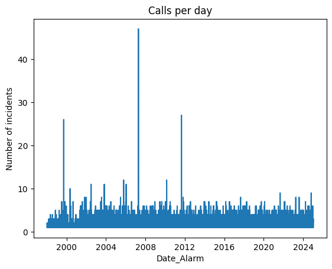
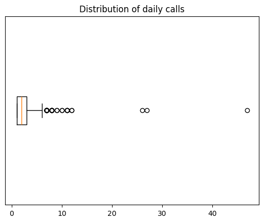
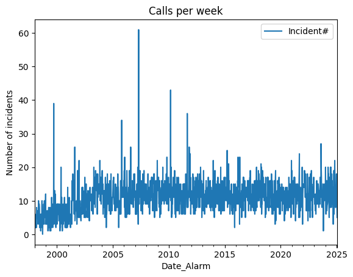
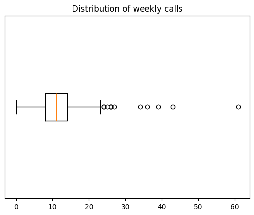
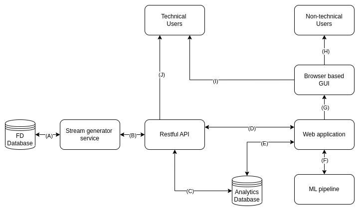
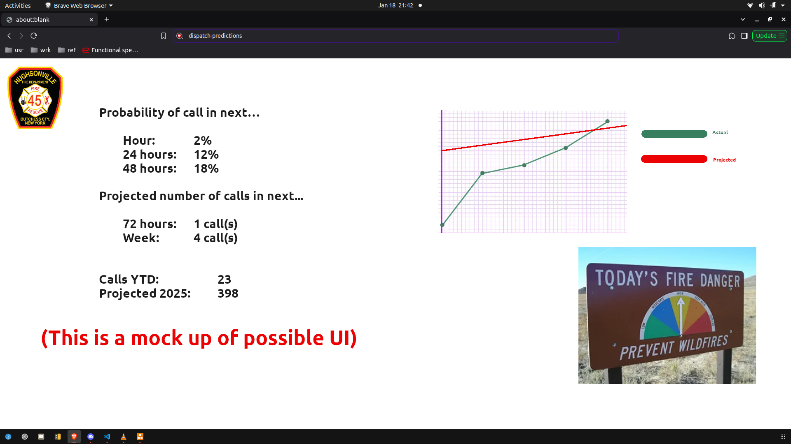

# MSDS 434 Dispatch Predictions

<div align=center>

DISPATCH PREDICTIONS: <br>MACHINE LEARNING ON EMERGENCY SERVICE CALL VOLUME  
</div>
<br><br>

<div align=center>

Kevin Geidel <br>
MSDS 434: Data Science & Cloud Computing<br>
Northwestern University<br>
March 16, 2025
<br>
</div>
<br>
</p>
<hr>

## Overview

- I am in section 55 (Winter '25.) This is my term project. <br>
- [Step 1: Identify the problem](#the-problem)
- [Step 2: Identify the data set](#the-data-set)
- [Step 3: Construct a functional specification](#functional-specification)
- [Step 4: Data ingest](#data-ingest)

## The problem

Low staffing in emergency services is problematic for many organizations; particularly volunteer fire departments. The issue is compounded during high call volume times (i.e. Winter storm events.) There are a number of strategies for alleviating the complications surrounding personnel shortages including duty crews and/or key members [i.e. chauffeurs] taking fly cars home with them. In paid departments there are also callbacks and overtime. The decision to deploy such tactics is largely informed by experience (and external information such as weather forecasts.)

**dispatch-predictions** aims to use *Machine Learning (ML)* to model the demand for fire & rescue services (calls/incidents) and use the model to predict future call volume. Specifically:

* When is the next call likely to occur?
* How many calls are expected in the next 1 hour? 24 hours? 48 hours? week?, etc.
* What factors influence the likely probability of a call occurring?
* Would the ML model be more reliable if fed raw time-series historical data or if it is used to solve a preformulated decision analytics problem (i.e a Queue problem?)
* What ML algorithms are best suited for this task?

## The data set

* Data consists of incident call logs from the [Hughsonville Fire Department](https://www.hfd45.org).
* Current state of the data is an xls export (1998-01-02 to 2025-01-14.)
* I am working on programmatic access to the Microsoft SQL Server that hosts it.
* Remainder of initial analysis performed in the form of *Exploratory Data Analysis (EDA)*:

```python
# MSDS 434 - Section 55
# Winter '25
# dispatch-predictions - EDA

# Kevin Geidel

from matplotlib import pyplot as plt
import pandas as pd
pd.set_option('display.max_rows', 500)
```
```python
file_path = 'data/2025_01_14_hfd_incident_log.xls'

df = pd.read_excel(file_path, parse_dates=[['Date', 'Alarm']])

df.head()  # Raw data frame
```
<div>
<table border="1" class="dataframe">
  <thead>
    <tr style="text-align: right;">
      <th></th>
      <th>Date_Alarm</th>
      <th>FDID</th>
      <th>Incident#</th>
      <th>Num</th>
      <th>Address</th>
      <th>Suite</th>
      <th>Zip</th>
      <th>Type</th>
      <th>Lgth</th>
    </tr>
  </thead>
  <tbody>
    <tr>
      <th>0</th>
      <td>01/02/2000 13:41</td>
      <td>14013.0</td>
      <td>2000-000001</td>
      <td>10</td>
      <td>BARBARA LA.</td>
      <td></td>
      <td>12590</td>
      <td>Natural vegetation fire</td>
      <td>0.0</td>
    </tr>
    <tr>
      <th>1</th>
      <td>01/04/2000 12:30</td>
      <td>14013.0</td>
      <td>2000-000002</td>
      <td>2015</td>
      <td>ROUTE 9 - UNIT 16</td>
      <td></td>
      <td>12590</td>
      <td>Emergency medical service (EMS) Incident</td>
      <td>0.5</td>
    </tr>
    <tr>
      <th>2</th>
      <td>01/04/2000 12:36</td>
      <td>14013.0</td>
      <td>2000-000003</td>
      <td>52</td>
      <td>OSBORNE HILL RD.</td>
      <td></td>
      <td>12590</td>
      <td>Emergency medical service (EMS) Incident</td>
      <td>0.7</td>
    </tr>
    <tr>
      <th>3</th>
      <td>01/05/2000 22:13</td>
      <td>14013.0</td>
      <td>2000-000004</td>
      <td>NaN</td>
      <td>NEW HAMBURG RD. @ WHEELER</td>
      <td></td>
      <td>12590</td>
      <td>Service call, other</td>
      <td>1.0</td>
    </tr>
    <tr>
      <th>4</th>
      <td>01/07/2000 22:34</td>
      <td>14013.0</td>
      <td>2000-000005</td>
      <td>206</td>
      <td>OLD HOPEWELL RD.</td>
      <td></td>
      <td>12590</td>
      <td>Good intent call, other</td>
      <td>0.3</td>
    </tr>
  </tbody>
</table>
</div>

```python
# stats on the raw dataframe
df.info()
```

    <class 'pandas.core.frame.DataFrame'>
    RangeIndex: 16172 entries, 0 to 16171
    Data columns (total 9 columns):
     #   Column      Non-Null Count  Dtype  
    ---  ------      --------------  -----  
     0   Date_Alarm  16172 non-null  object 
     1   FDID        15483 non-null  float64
     2   Incident#   15483 non-null  object 
     3   Num         13410 non-null  object 
     4   Address     15482 non-null  object 
     5   Suite       15437 non-null  object 
     6   Zip         15468 non-null  object 
     7   Type        16148 non-null  object 
     8   Lgth        15483 non-null  float64
    dtypes: float64(2), object(7)
    memory usage: 1.1+ MB
```python
# 689 records (16172 - 15483) don't have dates, incident #s or times.
# This looks like a issue with exporting certain call types 
# (maybe there was a newline char in the text?)
# drop records w/o dates

df = df.dropna(subset=['Incident#'])

# Coax cols into proper dtypes
df['FDID'] = df['FDID'].astype(str)
df['Date_Alarm'] = df['Date_Alarm'].astype('datetime64[s]')

# Repair the broken Type
broken_type = 'Unintentional system/detector operation (no '
df.loc[df['Type']==broken_type, 'Type'] = broken_type + 'fire)'

# re-check breakdown of rows/cols
df.info()
```

    <class 'pandas.core.frame.DataFrame'>
    Index: 15483 entries, 0 to 16171
    Data columns (total 9 columns):
     #   Column      Non-Null Count  Dtype        
    ---  ------      --------------  -----        
     0   Date_Alarm  15483 non-null  datetime64[s]
     1   FDID        15483 non-null  object       
     2   Incident#   15483 non-null  object       
     3   Num         13410 non-null  object       
     4   Address     15482 non-null  object       
     5   Suite       15437 non-null  object       
     6   Zip         15468 non-null  object       
     7   Type        15459 non-null  object       
     8   Lgth        15483 non-null  float64      
    dtypes: datetime64[s](1), float64(1), object(7)
    memory usage: 1.2+ MB


```python
# Visualize the data

# Group by date
calls_per_day = df['Date_Alarm'].groupby([df['Date_Alarm'].dt.date]).count()

calls_per_day.plot.line()
plt.title("Calls per day")
plt.ylabel("Number of incidents")
plt.show()
```    

```python
# Some descriptive statistics for daily call distribution
calls_per_day.describe()
```
    count    7471.000000
    mean        2.072413
    std         1.393897
    min         1.000000
    25%         1.000000
    50%         2.000000
    75%         3.000000
    max        47.000000
    Name: Date_Alarm, dtype: float64
```python
# view the distribution of calls per day

plt.boxplot(calls_per_day, orientation='horizontal');
plt.title("Distribution of daily calls")
plt.yticks([]);
``` 

```python
# Try again by week

calls_per_week = df[['Date_Alarm', 'Incident#']].groupby([pd.Grouper(key='Date_Alarm', freq='W')]).count()

calls_per_week.plot.line()
plt.title("Calls per week")
plt.ylabel("Number of incidents")
plt.show()
```

```python
# Some descriptive statistics for weekly call distribution
calls_per_week.describe()
```
<div>
<table border="1" class="dataframe">
  <thead>
    <tr style="text-align: right;">
      <th></th>
      <th>Incident#</th>
    </tr>
  </thead>
  <tbody>
    <tr>
      <th>count</th>
      <td>1412.000000</td>
    </tr>
    <tr>
      <th>mean</th>
      <td>10.965297</td>
    </tr>
    <tr>
      <th>std</th>
      <td>4.714327</td>
    </tr>
    <tr>
      <th>min</th>
      <td>0.000000</td>
    </tr>
    <tr>
      <th>25%</th>
      <td>8.000000</td>
    </tr>
    <tr>
      <th>50%</th>
      <td>11.000000</td>
    </tr>
    <tr>
      <th>75%</th>
      <td>14.000000</td>
    </tr>
    <tr>
      <th>max</th>
      <td>61.000000</td>
    </tr>
  </tbody>
</table>
</div>

```python
plt.boxplot(calls_per_week, orientation='horizontal');
plt.title("Distribution of weekly calls")
plt.yticks([]);
```


<hr>

## Functional specification

#### Project overview

  &nbsp;&nbsp;&nbsp;&nbsp;**dispatch-predictions** aims to forecast the occurrence of emergency incidents for a volunteer fire department. The primary objective is to let Chief officers and line officers respond proactively to upcoming high call volume times.

#### User roles & capabilities

  &nbsp;&nbsp;&nbsp;&nbsp;There is one class of users: firematic officers. They will have access to the forecasts, descriptive metrics and status of the model (i.e. feature importance, last update, number of records, etc.)

#### Core functionality

  &nbsp;&nbsp;&nbsp;&nbsp;**Data collation** will occur via GoLang pipelines consisting of HTTP API streams from a client portion with access to the department's incident log and a server portion that handles data cleaning, feature engineering and the analytics mirror database. 

  &nbsp;&nbsp;&nbsp;&nbsp;**Forecasting** will be accomplished via time series regression using Python's SciKitLearn. Pandas will be used for data manipulation throughout.

  &nbsp;&nbsp;&nbsp;&nbsp;**Reporting** will provide both a web-based UI and Restful API.

#### Technical requirements
   
  * Cloud based virtual machine: AWS EC2 t2.micro running Ubuntu 24.04
  * RDMS: AWS Aurora running PostgreSQL16
  * Web application: Django framework with both web browser GUI and Rest API
  * ML pipeline: Transformations, cleaning and models via SciKitLearn
  * Data stream generator: GoLang service on FD workstation

#### Non-functional requirements

  * Non-public information should not be made available without user authentication. 
  * Maximum up time will ensure quality forecasts and actionable insights.
  * Straightforward UI for non-technical users.


#### Error reporting & monitoring

  &nbsp;&nbsp;&nbsp;&nbsp;**System logs** will be maintained with OS, application and network warnings, errors and information. These are for developers to monitor the status of the web app and address any issues. Email **alerts** will be used to notify developers when errors are logged.

  &nbsp;&nbsp;&nbsp;&nbsp;The Django messages framework will be utilized to generate and display notifications to users on the web app's GUI. These will include warnings, errors and information.

#### Architecture & design
 
 &nbsp;&nbsp;&nbsp;&nbsp;Below is a flowchart to illustrate how the system works and how users navigate through it. A description of how each element interacts with one another follows.

  

  **(A):** The stream generator is a custom GoLang package that retrieves call log data from the fire department data base by issuing queries. The data base returns results to the generator.

  **(B):** The generator will need to query the API with a GET request in order to determine which records are new and must be sent. The API will respond with the latest call in the data base. The generator service will then issue a POST request to the API with the latest incidents.

  **(C):** The API must write new incidents into the data base. The API will also query the data base for call meta data (i.e. most recent call.) Finally, the API can also be used for programmatic access to the raw data, ML model meta data and forecasts themselves.

  **(D):** The web application will be used to construct the views needed for the API to perform its duties. These include providing serializers, view sets and filters.

  **(E):** The web application will query the data base for raw data, ML forecasts and system meta data. The data base will return query results for display in tables, reports and alerts.

  **(F):** The web application will trigger ML methods: cleaning, transformations, modeling, etc. The web application will also provide the records used in training, testing and prediction. The pipeline returns prediction results and meta data about the forecasts (i.e. feature importance, confidence intervals, etc.)
  
  **(G):** The web application provides views that take requests and return the HTTP responses that constitute the GUI.

  **(H):** Non-technical users and non-developer stake holders (firematic officers) will use the GUI to interact with the forecasts. This will occur in tables, reports and visualizations. 

  **(I):** Developers and other technical users can use the GUI as well.

  **(J):** Technical users will be able to use HTTP web requests to query the API directly for whatever their permissions allow (raw data, meta data, forecast data, etc.)

#### Deployment

* **dispatch-predictions** will be a containerized application (via **docker**) and deployed from a cloud based virtual machine. AWS will be utilized for its IaaS products. The developer will provision, manage, monitor and maintain the servers hosting the various components of the web app.

* There are several distinct advantages to this approach when compared to other deployment tactics (such as using a PaaS framework like Elastic Beanstalk from AWS.) 
  * Only provision what you need. You are the system admin!
  * There are less moving parts when compared to full featured app engines that try to do it all.  
  * Tighter control over security. PaaS products typically use shared VPCs, security rules, roles/permissions, etc. 
  * Less dependence on a particular vendor. There are innumerable ways to get servers on the web in an affordable manner and our containerized application will run on essentially all of them. 

* As development proceeds there will be deliberate efforts to try and mitigate the disadvantages to this approach (as compared to PaaS.)
  * There is more for developers to manage. They are full stack and this means more user stories, more technologies to learn, more irons in the fire in general.
  * As a corollary to the point above, we are not as agile as we would of been using PaaS for deployment. We must provision our own resources, maintain our own infrastructure and maintain our own CI/CD work flows.
  * The above points can lead to higher barrier to entry for teams with out the full stack skill set or resource capacity. 

#### Example UI
  
  &nbsp;&nbsp;&nbsp;&nbsp;Users may see a main dashboard screen similar to the one shown below. This mock up captures the primary MVP objectives but does not include many stretch features that may or may not be incorporated. As development proceeds there will emerge a clearer picture of what the delivered application will be able to do and look like.

  


#### Version control, review & documentation
  
  &nbsp;&nbsp;&nbsp;&nbsp;The project, including this technical specification, is stored in a **git** repository. The upstream remote for the repo can be found at [https://github.com/kgeidel/msds434-dispatch-predictions](https://github.com/kgeidel/msds434-dispatch-predictions). Additional documentation can be found in the README, `docs` directory, `man` directory and throughout the code base in the form of doc strings and comments. Stakeholders are encouraged to review this documentation and respond with their approval or concerns to the developer.

## Data ingest

There are two vectors for loading incident records into the database. The first is [a bulk upload](#bulk-upload-of-redalertnmx-exports) for back populating purposes. The second is the primary way in which the database receives new records and involves [sending records through a web-based RESTful API](#stream-processing-of-new-incident-records).

#### Bulk upload of RedAlertNMX exports

In the Django project directory (`dispatch-predictions-app`) is a Jupyter notebook with a script that can load records from an excel spreadsheet (xls format.) This logic could easily be moved to a static method on the **Incident** model but this process it only for populating a fresh database with historical records. It will not be used once the database is populated and the entirety of the architecture is deployed.

The spreadsheet comes from the client application used by the firehouse- *RedAlertNMX*. There are about 15,400 records so they easily fit in a single spreadsheet. There is some column cleaning and preprocessing that must take place in the script before the records are fit for consumption.

Pandas is used to load the data from the spreadsheet and perform the preprocessing steps. Once the data is cleaned we iterate through the records of the dataframe and use the Django ORM to create the instances.

```python
# Python imports
import os

# Django imports
from django.utils import timezone
import datetime as dt

# 3rd party imports
from tqdm import tqdm
import pandas as pd
pd.set_option('display.max_rows', 500)

# Intraproject imports
import django_init
from django.conf import settings
from calls.models import Incident, DISP

# load into pandas dataframe with proper cleaning & transforming
input_path = os.path.join(
    settings.BASE_DIR.parent, 
    'data', '2025_01_14_hfd_incident_log.xls',
)

df = pd.read_excel(input_path, parse_dates=[['Date', 'Alarm']])
df = df.dropna(subset=['Incident#'])
df['FDID'] = df['FDID'].astype(str)
df['Date_Alarm'] = df['Date_Alarm'].astype('datetime64[s]')
broken_type = 'Unintentional system/detector operation (no '
df.loc[df['Type']==broken_type, 'Type'] = broken_type + 'fire)'

# load into database

for index, record in tqdm(df.iterrows()):
  Incident.objects.get_or_create(
      num = str(record['Incident#']).strip(),
      dtg_alarm = record['Date_Alarm'].to_pydatetime().astimezone(settings.TIME_ZONE_OBJ),
      defaults = dict(
          fd_id = str(record['FDID']).strip('.0'),
          street_number = str(record['Num']).strip() if pd.notna(record['Num']) else None,
          route = str(record['Address']).strip() if pd.notna(record['Address']) else None,
          suite = str(record['Suite']).strip() if pd.notna(record['Suite']) else None,
          postal_code = str(record['Zip']).replace('-', '').strip()[:5] if pd.notna(record['Zip']) else None,
          disp = DISP.objects.get_or_create(type_str=str(record['Type']).strip())[0] if pd.notna(record['Type']) else None,
          duration = record['Lgth'] if pd.notna(record['Lgth']) else None,
      )
)
```
#### Stream processing of new incident records

Once the database is caught up with the system of record (the firehouse's MS SQL Server) we only need to process new calls as they occur. 


>In the final state this will be accomplished by a Go application that runs on a workstation with access to the system of record. While this component is still being developed, I have completed the REST API that will accept the list of new calls via POST web requests. This component will be demonstrated below.


Here is a python example of what the Go application would need to replicate to add records to the database (this could also be accomplished with curl or the browsable API site.)

```python
import requests, json, os
from pprint import pprint

token = os.getenv('WEB_APP_API_TOKEN')

data = [
    {'num': 'FOO', 'dtg_alarm': "1998-08-28T13:41:00-05:00"},
    {'num': 'BAR', 'dtg_alarm': "2525-01-02T13:41:00-05:00"},
]

requests.post(
    'http://localhost:8000/api/calls/bulk_update_or_create/', 
    headers={'Authorization': f'Token {token}'}, json=data
)
```

This would add two calls, one with call number "FOO" and the other "BAR" to the database. This process is demonstrated in the Week 4 project update video.